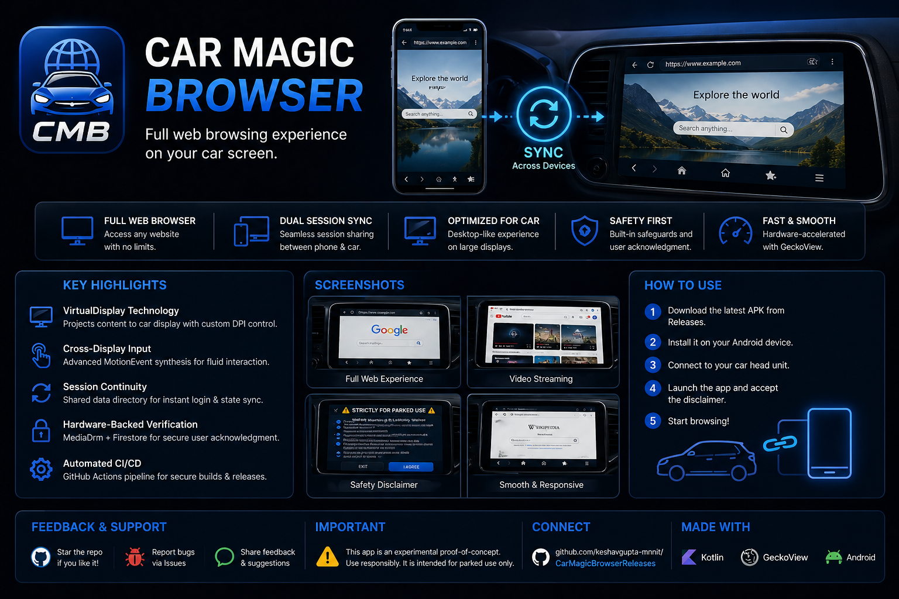

# 🚗 Car Magic Browser (CMB)

  

  

  
  

---

## ✨ Overview

**Car Magic Browser (CMB)** is an experimental Android application that enables a **full web browsing experience on car infotainment displays**.

It leverages Android’s internal display system and GeckoView to deliver a **desktop-like browsing experience** on secondary automotive screens.

---

## 🚀 Key Features

- 🌐 Full browser engine (GeckoView, not limited WebView)  
- 🔄 Seamless session sync between phone & car  
- 🖥️ Desktop-class rendering on car display  
- ⚡ Hardware-accelerated performance  
- 🎯 Optimized for large automotive screens  

---

## 🧠 Core Architecture

- VirtualDisplay API for secondary screen rendering  
- Dual GeckoView sessions (phone + car)  
- Shared persistent storage for session sync  
- MotionEvent-based cross-display input injection  

---

## 📦 APK Size Note

This is a **universal APK** and includes a full browser engine (GeckoView).

👉 Because of this:
- APK size is larger than typical apps  
- Ensures consistent performance across devices  
- No dependency on system WebView  

---

## 📱 How to Use

1. Download the latest APK  
2. Install it on your Android device  
3. Connect to your car head unit  
4. Launch the app  
5. Accept the disclaimer  
6. Start browsing  

---

## ⚠️ Safety Notice

This is a **proof-of-concept project**.

- Intended for non-driving scenarios  
- Includes user acknowledgment flow  
- Use responsibly  

---

## 🔍 Tech Stack

- Kotlin (Android)  
- GeckoView (Mozilla)  
- VirtualDisplay API  
- MotionEvent Input Injection  
- MediaDrm (Widevine)  
- Firebase Firestore  
- GitHub Actions (CI/CD)  

---

## 📥 Download

👉 https://github.com/keshavgupta-mnnit/CarMagicBrowserReleases/releases/latest

---

## 👨‍💻 Author

Keshav Gupta  
Android Developer  

---

⭐ If you found this interesting, consider starring the repo!
